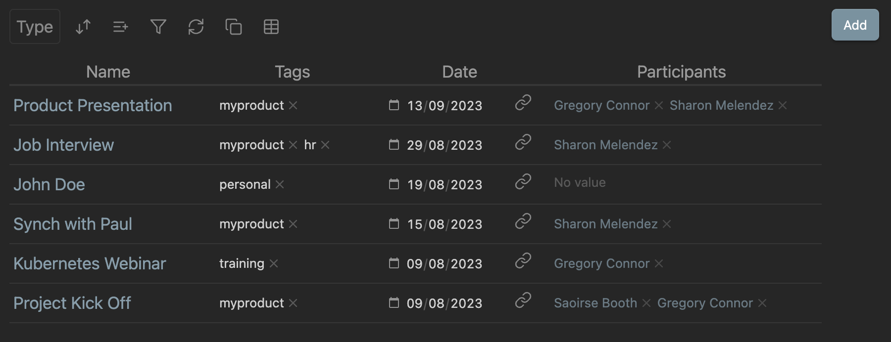

# Obsidian Sets

This plugin is currently under development

This plugins is inspired by [Notion](https://www.notion.so) and [AnyType](https://anytype.io) and implements a way to strucure data using obsidian notes, specifically the recently released properies.

It provides the following features:
- usage of Obsidian properties to edit data
- a query engine that allows to select items based on their properties
- Types and Collections
- visualizations of items using different layouts (Grid, Board, Gallery, List)
- easy creation of new items from the GUI

Please see full documentation [here](docs/doc.md)

## Installation

<!-- ### From within Obsidian

- Open Settings > Community plugins
- Make sure Safe mode is **off**
- Click Browse community plugins
- Search for "Sets"
- Click Install
- Once installed, close the community plugins window and activate the newly installed plugin -->

### Manual installation

- Download the latest release from the [releases page](https://github.com/Canna71/obsidian-sets/issues)
- Extract the plugin folder from the zip to your vault's plugins folder: `<vault>/.obsidian/plugins/obsidian-sets/`
- Reload Obsidian

## Reporting Issues

If you have any issues or suggestions please report them [here](https://github.com/Canna71/obsidian-sets/issues)

