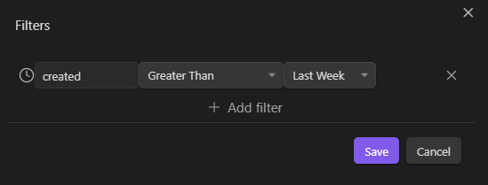

# Obsidian Sets

This plugins is inspired by Notion and AnyType and implements a way to strucure data using obsidian notes, specifically the recently released properies.

In short, this plugin consists of:
- the usage of metadata properties to store data
- a query engine that allows to select items based on their properties
- visualizations of items using different layouts
- some "pre configured" usage like Sets and Collections

## Settings

This plugins saves some notes in the vault in special places that can be configured in the settings.
By default, the following folders structure is used:

```
/Sets                   # "Sets Folder" can be configured
  |- Types              # "Types Folder" can be configured
  |    |- Name1Type.md  # "Type Suffix" can be configured
  |    └─ Name1Type.md
  |- Name1Set           # "Type Set Suffix" can be configured
  |    |─ item1.md
  |    └─ item2.md
  |─ Name2Set
  |    |─ item3.md
  |    └─ item4.md
  |- Collections        # "Collections Folder" can be configured
  |    |- Collection1
  |    |    └─ Collection1.md  
  |    └─ Collection2  
  |         └─ Collection2.md
```

Also by default, the following property names are used, but can be changed in the settings:
- `type`: the type of the item
- `collection`: the collections to which the item belongs

### Top Results

By default the plugin will display the first 200 results of a query. This can be changed in the settings.


## Properties
Like other systems out there, we use notes as they were "objects" and use metadata properties to store attributes of those objects.
This plugin leverages the newly introduced properties in Obsidian `1.4.5`

### Property types
This plugin is using the same property types as Obsidian, plus might add its own, if enabled in the settings. At the moment the only additional type is `password`, which allows the storage of data that is not shown in the UI.

## Set Block

In order to instantiate a view to query your vault, you enter a code block like the following:


~~~yaml
```set
```
~~~

Then everything is editable using the GUI. The first thing you will have to select, though is a *Scope*.

## Scope

A scope is *where* the query will look for items. There are 4 scopes:

- `Type`: items are restricted to a given type.
- `Collection`: items are restricted to a given collection.
- `Folder`: items are restricted to a given folder.
- `Vault`: items can be anywhere in the vault.

# Types

A type is a set of items that share the same properties. In other words, a type is a set of items that can be described by the same set of properties. 

You create a type by using the command `Sets: Create a new type`. 
It will ask you a name:


After you click save, it will create the following:
- a note with the name you provided plus a suffix (By default `Type`). This will be the archetype for items of this type. Think of it as a template.
- This note will have a property `type` with the value you provided.
- A folder with the same name as the note - plus a suffix (by default `Set`), where  items of this type could be stored.
- A note, in the folder above, with the same name as the folder, that will display the items of this type.

You will then need to add properties to the type. You can do this by adding properties to the note that represent the type. 
Remember that when you create a new property, or assign a type, this will be valid for the entire vault.

If you go to the Set folder that was created, you will see a note with the same name as the folder. This note will display all items of this type in the vault.

In order to display items of this type in a different note, you can create a view, by adding a code block as descibed above, and then specifying the scope as `Type` and the type as the one you just created.


More on queries and views later.

# Collections

A collection is a set of items that are explicitely added to it. In other words, a collection is a set of items that are not necessarily of the same type, but that are explicitely added to it.

You create a collection by using the command `Sets: Create a new collection`.
It will ask you a name:


After you click save, it will create the following:
- a note with the name you provided. 
- This note will have a `type` `collection` even if this is only marginal
- This note will contain a view that will display all items of this collection.

You will then need to add items to the collection. 
To do so, you can right click on the explorer or in the file menu and select `Add to collection` or use the command `Sets: Add to collection`.

In order to display items of this collection in a different note, you can create a view, by adding a code block as descibed above, and then specifying the scope as `Collection` and the collection as the one you just created.

## Folder
Queries can be scoped to a Folder. This means that only items in that folder will be considered. Further filters can be applied to the query, to further restrict the items that are considered.

## Vault
A query with the scope set to Vault will consider all items in the vault. Further filters can be applied to the query, to further restrict the items that are considered.

# Queries

A query is a way to select items based on their properties. After you specified the scope, you could further customize the query by specifying:
- further filters to apply using various operators
- which fields to display (for types, the default will be the fields in the Archetype)
- in which order to display the fields
- in which order to display the items

## Filters

A filter is composed of:
- An attribute
- An operator
- A value

### Attributes
An attribute can either be a metadata property, or an intrinsic attribute of the file. Intrinsic properties are:
- `FileName`: the name of the file
- `Path`: the path of the file
- `Creation Date`: the creation date of the file
- `Modification Date`: the modification date of the file

### Operators
Operators depends on the type of the attribute on which you are filtering. For example, for data attributes, operators are:
- `Equal`
- `Not Equal`
- `Is Not Empty`
- `Is Empty`
- `Greater Than`
- `Greater Than or Equal`
- `Less Than`
- `Less Than or Equal`

### Values

A value can either be a static value that you enter in the filter itself, or a dynamic value that is evaluated when the query is run.

Dynamic values are:
- `Today`: the current date
- `Yesterday`: yesterday's date
- `Tomorrow`: tomorrow's date
- `Last Week`: the beginning of last week
- `This Week`: the beginning of this week
- `Next Week`: the beginning of next week
- `Last Month`: the beginning of last month
- `This Month`: the beginning of this month
- `Next Month`: the beginning of next month
- `This`: the link to the current note (the one hosting the set block itself)




**Note**: to filter for an item whose `date` is last week, you need to apply both the following filters clauses:
- `date` `Greater Than or Equal` `Last Week`
- `date` `Less Than` `This Week`

## Calculated Fields
When adding fields to be displayed, you can also specify calculated fields, which are fields that use javascript code in order to display a calculated value.
The code will have access to the `prop()` function which takes the name of a property and will return the value of that property for the current item.
The code could be either an expression or a sequence of statements.

### Examples

#### Expression: product of two properties

~~~
```js
prop("num")*prop("price")
```
~~~

#### Statements: representation of a rating value using stars

~~~
```js
const fullStars = Math.floor(prop("rating")); 
let result = '';     
for (let i = 0; i < 5; i++) {         
	result += i < fullStars ? '★' : '☆';     
}   
return result;
```
~~~


# Views

All queries are displayed in a view. A view is a way to display items. There are currently 4 types of views:
- `Grid`: displays items as a data grid
- `List`: displays items as a list
- `Board`: displays items as a kanban board
- `Gallery`: displays items as a card gallery
    
Some views might have additional settings.

## Grid


A Grid displays data in a tabular form and allows the editing of the data directly in the view. 
Displayed attributes can be ordered also by ordering the respective columns.
Columns can be resized by dragging the column separator.

If a Grid contais also the FileName property, it will allow for the editing of the name of the file directly in the view. Otherwise will display a link to the file in order to navigate to the note corresponding to the item.


## List


A List displays data in a list form and does not allow the editing of the data directly in the view, except for properties of type `Checkbox`, `Date` and `Date & Time`.

## Board    


A board displays items in *lanes* and allows to drag and drop items from one lane to another. 
Each *lane* correspong to a value of a given property. The property can be selected in the settings of the view, using the [Select] button that appears when you select the `Board` view.

The first lane is there by default, and will display items that do not have a value for the selected property.
Other lanes must be created by clicking on the `+` button that is on the right of the rightmost lane.
By clicking on the header you can set or change the value of the property for that lane.

All fields of the item (that are selected to be displayed) will be displayed (in the order specified) and will be editable.

By dragging an item from one lane to another, the value of the grouping property will be changed accordingly.


# Creating new items

From some views you can create new items. This is done by clicking on the `Add` button that is on the right of the toolbar.
The availability of the `Add` button depends on the view and on the filters that are applied to the view.
In short, you can create new items from a view if it is possible to determine which properties the new item should have in order to satisfy the filters of the view.
This also means that filters will be used to apply default values to the properties of the new item.

For example, if you have a view that displays all tasks that are `relative-to` `This` (that is, all subtasks of the current note), then you can create a new task from that view, and the new task will have the `relative-to` property set to the current note.

In case the current query is not restricted to a type, then the attributes that the new item will have will be determined by the type itself, otherwise they will be the properties selected to be displayed in the view.

You can also create new items from the command palette, by using the command `Sets: Create a new <Type Name>`. A different command is available for each type you create.


## From a type / templating

When you create a new item from a type, the note will be created from the archetype of the type. This means that the note will be created from the template that you defined for the type. The archetype will be treated as a template, and the templating engine used is [Squirrelly](https://squirrelly.js.org/).

Writing templates, you have acces to a context object (`it`) with the following properties:

- `it.type`: the type of the item
- `it.properties`: the properties names of the item
- `it.time`: the time in `HH:mm:ss` format
- `it.date`: the date in `YYYY-MM-DD` format
- `it.archetype`: the template file itself
- `it.folder`: the folder where the item is created
- `it.context`: the file from which the item was created
- `it.name`: the name of the item

### Special properties
Properties starting with double underscore (`__`) are special properties that are not copied to the new item, but are used to provide additional information to the plugin.
At the moment the following special properties are available:
- `__name_prefix`: the value will be added at the beginning of the name of the new item
- `__name_suffix`: the value will be added at the end of the name of the new item

As an example: this is a possible archetype for a Meeting Type:

~~~yaml
---
type: meeting
tags: []
date: "{{it.date}}"
__name_prefix: "{{it.date}}-"
__name_suffix: -meeting
participants:
---
~~~

## Where are new items created?

When you create a new item from a Set Block, it will be created in the same folder as the note hosting the Set Block itself.
When you create a new item of a given type using the command palette, it will be created in the folder of the type.


# Sidebar

An optional sidebar gives access to the different collections and types. It also enables the creation of new widgets, which can be configured to display any set of items, by specifying the query to be used.
